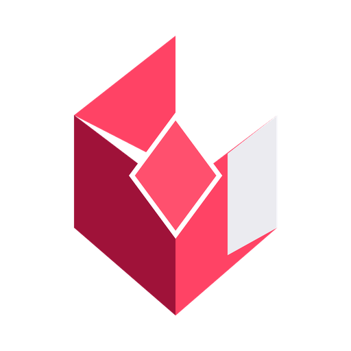

<div align="center">



# Syntra Chat

**A permission-aware enterprise AI knowledge platform.**
Chat with your organization's internal documents and data — grounded, cited, and scoped to what you're allowed to see.

[](#tech-stack)
[](#tech-stack)
[](#tech-stack)
[](#tech-stack)
[](#tech-stack)
[](#tech-stack)
[](#status)

</div>

---

## Table of Contents

- [Why Syntra Chat](#why-syntra-chat)
- [Features](#features)
- [Tech Stack](#tech-stack)
- [Architecture](#architecture)
- [Status](#status)

---

## Why Syntra Chat

Enterprise knowledge is scattered across drives, folders, and spreadsheets, and most search tools either surface everything (a permissions nightmare) or nothing useful (too literal). Syntra Chat sits in between: it understands natural language, respects your organization's access controls down to the folder level, and answers with receipts — every claim is traceable back to a source document.

---

## Features

### Chat & Discovery
- Natural-language chat over company knowledge
- Natural-language file and folder discovery — no manual browsing required
- `@mentions` to pull specific files or datasets directly into a conversation
- Conversation-level active file/folder context, so follow-up questions stay scoped
- Cross-document synthesis with source attribution for broader, unscoped questions

### Grounded Answers
- Document RAG (retrieval-augmented generation) with inline citations
- Dataset analysis powered by Python — ask questions of Excel/CSV data directly
- Chart and graph generation on request

### Organization
- File and folder organization for documents and datasets
- Collections for grouping related chats
- Chat search by name

### Access Control
- Role-based access control (RBAC) with reusable folder-access templates
- Folder- and document-level permissions, including subfolder cascade and exclusion rules
- Download permission controls per file/folder
- Access-request workflow with full audit history
- Locked (not hidden) folders — restricted users can see a folder exists and request access

### Administration
- Admin panel with user, role, and department management
- PDF and file downloads directly from chat (where permitted)

### Experience
- Light / Dark / System themes
- Full mobile and tablet responsiveness

---

## Tech Stack

| Layer           | Technology              |
|------------------|--------------------------|
| Frontend         | Angular                  |
| Backend          | NestJS                   |
| AI Service       | Python + FastAPI         |
| AI Workflow      | LangGraph / LangChain    |
| LLM              | Google Gemini            |
| Embeddings       | BAAI/bge-base-en-v1.5    |
| Database         | MongoDB Atlas (incl. vector search) |

---

## Architecture

```
+------------+      +------------+      +---------------------+
|  Angular   | ---> |   NestJS   | ---> |  FastAPI (Python)    |
|  Frontend  | <--- |   Backend  | <--- |  AI Service          |
+------------+      +-----+------+      |  LangGraph/LangChain |
                           |             |  Gemini + BGE Embed  |
                           v             +----------+-----------+
                    +--------------------+          |
                    |   MongoDB Atlas     | <--------+
                    | (app data + vectors)|
                    +--------------------+
```

---

## Status

Syntra Chat is currently in **active development and internal testing**, and has not yet been deployed to production users.
