<p align="center">
  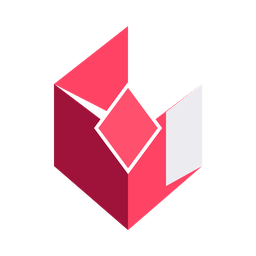
</p>

# Syntra Chat — System Architecture

> **Authoritative Technical Architecture, Infrastructure & Implementation Reference**  
> *Version:* 5.0 (Monorepo Standard — Full Codebase Audit)  
> *Target Audience:* Core Engineers, Systems Architects, Security Auditors, and Autonomous AI Agents

---

## Table of Contents

1. [Executive Architecture Summary](#1-executive-architecture-summary)
2. [Repository / Monorepo Architecture](#2-repository--monorepo-architecture)
3. [Technology Stack](#3-technology-stack)
4. [Service Architecture](#4-service-architecture)
5. [Frontend Architecture](#5-frontend-architecture)
6. [Frontend State Architecture](#6-frontend-state-architecture)
7. [Authentication Architecture](#7-authentication-architecture)
8. [Authorization Architecture](#8-authorization-architecture)
9. [Security Boundaries](#9-security-boundaries)
10. [Database Architecture](#10-database-architecture)
11. [Database Relationships](#11-database-relationships)
12. [Conversation Architecture](#12-conversation-architecture)
13. [Temporary Chat Architecture](#13-temporary-chat-architecture)
14. [Active Scope Architecture](#14-active-scope-architecture)
15. [Message Architecture](#15-message-architecture)
16. [Collection Architecture](#16-collection-architecture)
17. [Archived Chat Architecture](#17-archived-chat-architecture)
18. [File Architecture](#18-file-architecture)
19. [Duplicate Filename Architecture](#19-duplicate-filename-architecture)
20. [File Move Architecture](#20-file-move-architecture)
21. [File Move Undo Architecture](#21-file-move-undo-architecture)
22. [File Replacement Architecture](#22-file-replacement-architecture)
23. [Download Permission Architecture](#23-download-permission-architecture)
24. [Dataset Architecture](#24-dataset-architecture)
25. [Document Ingestion Architecture](#25-document-ingestion-architecture)
26. [Embedding Architecture](#26-embedding-architecture)
27. [Vector / Index Architecture](#27-vector--index-architecture)
28. [RAG Architecture](#28-rag-architecture)
29. [AI Service Architecture](#29-ai-service-architecture)
30. [AI Graph / Orchestration](#30-ai-graph--orchestration)
31. [AI Context Construction](#31-ai-context-construction)
32. [AI Token Optimization](#32-ai-token-optimization)
33. [LLM Architecture](#33-llm-architecture)
34. [API Architecture](#34-api-architecture)
35. [API Request Lifecycles](#35-api-request-lifecycles)
36. [Admin Architecture](#36-admin-architecture)
37. [Access Request Architecture](#37-access-request-architecture)
38. [Audit Log Architecture](#38-audit-log-architecture)
39. [Notification Architecture](#39-notification-architecture)
40. [Error Architecture](#40-error-architecture)
41. [External Services](#41-external-services)
42. [Environment Configuration](#42-environment-configuration)
43. [Deployment Architecture](#43-deployment-architecture)
44. [Development Workflow](#44-development-workflow)
45. [Testing Architecture](#45-testing-architecture)
46. [Critical Workflow Test Matrix](#46-critical-workflow-test-matrix)
47. [Data Lifecycle](#47-data-lifecycle)
48. [State Machines](#48-state-machines)
49. [Architectural Invariants](#49-architectural-invariants)
50. [Architectural Decision Records](#50-architectural-decision-records)
51. [Security Threat Model](#51-security-threat-model)
52. [Failure Modes](#52-failure-modes)
53. [Observability](#53-observability)
54. [Performance Considerations](#54-performance-considerations)
55. [Current Limitations](#55-current-limitations)
56. [Planned / Future Architecture](#56-planned--future-architecture)
57. [Glossary](#57-glossary)
58. [Code Reference Index](#58-code-reference-index)

---

# 1. Executive Architecture Summary

**Syntra Chat** is a multi-tier, secure enterprise AI platform designed for organizational knowledge retrieval, structured dataset analysis, and departmental collaboration. It blends conversational AI with deep document retrieval (RAG), sandboxed tabular data analytics (Python/Pandas execution), granular Access Control Lists (ACLs), and persistent workspace memory.

### Core Architectural Pillars:

1. **Frontend Tier (Angular 19 Standalone)**: Responsive Single-Page Application (SPA) driven by Angular Signals and RxJS observables. Features a multi-chat composer with background concurrency control (max 2 active generations), live markdown rendering with syntax highlighting, dynamic chart rendering (Chart.js), client-side lazy conversation initialization, and high-contrast notifications.
2. **Backend API Gateway Tier (NestJS 10)**: Enterprise Node.js orchestrator providing RESTful endpoints, Passport JWT authentication, Argon2/bcrypt password hashing, multi-tier RBAC/ACL resolution, MongoDB GridFS binary streaming, Nodemailer CID email delivery, and a resilient streaming AI Gateway with exponential backoff.
3. **AI Microservice Tier (FastAPI + LangGraph + Python 3.11)**: Deterministic, state-machine-driven agent graph orchestrating document RAG, AST-sandboxed Pandas analysis, dynamic ChartSpec generation, and math calculation. Embeddings are generated using local BGE models (`BAAI/bge-base-en-v1.5`, 768 dimensions), with vectors stored directly in MongoDB chunks and queried via NumPy cosine similarity.
4. **Data Persistence Tier (MongoDB Atlas / Community)**: Document-oriented database serving application collections (`users`, `roles`, `folders`, `documents`, `datasets`, `conversations`, `messages`, `collections`, `accessrequests`, `systemsettings`) and GridFS binary buckets (`uploads.files`, `uploads.chunks`).

### System Topography

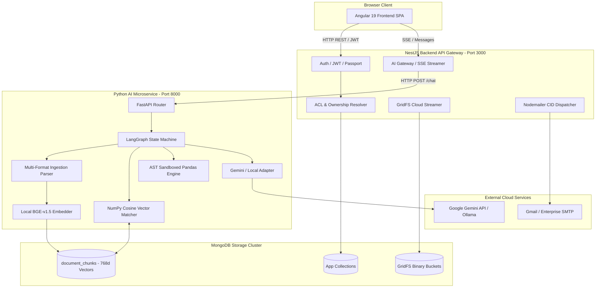

---

# 2. Repository / Monorepo Architecture

The repository is structured as an npm workspaces monorepo containing three core applications and one shared TypeScript contracts package:

```text
/
├── apps/
│   ├── frontend/                 # Angular 19 Client SPA
│   │   ├── src/
│   │   │   ├── app/
│   │   │   │   ├── core/         # Singletons, Guards, Interceptors, API/Auth Services
│   │   │   │   ├── features/     # Chat, Documents, Datasets, Admin, Settings, Docs
│   │   │   │   └── shared/       # Reusable components (TableViewer, ChartViewer, Dialogs)
│   │   │   ├── styles.scss       # Global CSS / Tailwind directives / Animations
│   │   │   └── main.ts           # Browser bootstrap
│   │   ├── package.json
│   │   └── tailwind.config.js
│   ├── backend/                  # NestJS 10 REST API & Gateway
│   │   ├── src/
│   │   │   ├── auth/             # JWT, Local strategy, password reset, guards
│   │   │   ├── permissions/      # ACL resolution, ownership verification, department rules
│   │   │   ├── documents/        # File upload, replace, move, delete, download, permissions
│   │   │   ├── datasets/         # Tabular dataset schemas, rows, stats, inspection
│   │   │   ├── conversations/    # Lazy-persisted chat management, pinning, archiving
│   │   │   ├── messages/         # Message storage, grounding, conversation streaming
│   │   │   ├── collections/      # Topic folders for chats, drag-and-drop, shared memory
│   │   │   ├── access-requests/  # Resource access approvals workflow
│   │   │   ├── ai-gateway/       # HTTP client proxying requests to AI service
│   │   │   ├── storage/          # MongoDB GridFS streaming engine
│   │   │   ├── mail/             # Nodemailer CID template engine
│   │   │   ├── users/            # User CRUD, role assignments, department provisioning
│   │   │   ├── roles/            # Role definitions and administrative privilege mapping
│   │   │   └── main.ts           # NestJS application bootstrap & CORS setup
│   │   ├── package.json
│   │   └── tsconfig.json
│   └── ai-service/               # Python 3.11/3.12 AI Microservice
│       ├── agents/
│       │   ├── graph.py          # Deterministic LangGraph StateGraph orchestration
│       │   └── state.py          # AgentState TypedDict definition
│       ├── core/
│       │   ├── config.py         # Pydantic BaseSettings environment manager
│       │   ├── database.py       # PyMongo / Motor database connection pool
│       │   └── gridfs_storage.py # GridFS stream reader for ephemeral ingestion
│       ├── data_analysis/
│       │   ├── dataset_loader.py # GridFS DataFrame loader for CSV/XLSX
│       │   └── sandbox.py        # AST-validated Python code execution sandbox
│       ├── embeddings/
│       │   ├── base.py           # BaseEmbeddingProvider abstract interface
│       │   ├── bge_local.py      # BAAI/bge-base-en-v1.5 local SentenceTransformer
│       │   ├── gemini.py         # Google Gemini embedding provider adapter
│       │   └── factory.py        # Embedder factory singleton
│       ├── llm/
│       │   ├── base.py           # BaseLLMProvider interface
│       │   ├── gemini_adapter.py # Google GenAI LangChain ChatGoogleGenerativeAI adapter
│       │   ├── local_adapter.py  # Ollama / OpenAI-compatible local adapter
│       │   └── factory.py        # LLM provider factory
│       ├── rag/
│       │   ├── ingestion.py      # Text extraction (PDF, DOCX, TXT, XLSX, CSV), Chunking, Vector Storage
│       │   └── retrieval.py      # Scoped NumPy cosine similarity vector search
│       ├── routers/
│       │   ├── chat.py           # POST /chat LangGraph execution endpoint
│       │   ├── ingest.py         # POST /rag/ingest document processing endpoint
│       │   ├── dataset.py        # POST /dataset/inspect dataset schema parser
│       │   └── health.py         # GET /health healthcheck
│       ├── schemas/              # Pydantic models for chat, citations, charts, tables
│       ├── pyproject.toml        # uv / hatchling Python project configuration
│       └── main.py               # FastAPI application entry point
├── packages/
│   └── shared-types/             # TypeScript universal interface contracts
│       ├── src/
│       │   ├── auth.types.ts
│       │   ├── document.types.ts
│       │   ├── dataset.types.ts
│       │   ├── conversation.types.ts
│       │   ├── message.types.ts
│       │   ├── ai.types.ts
│       │   ├── folder.types.ts
│       │   └── collection.types.ts
│       └── package.json
├── package.json                  # Root npm workspace configuration
└── architecture.md               # Master Architecture Reference
```

---

# 3. Technology Stack

| Technology | Version | Service | Purpose | Architectural Role |
| :--- | :--- | :--- | :--- | :--- |
| **Angular** | `^19.0.0` | Frontend | Web SPA Framework | Standalone UI, routing, signals, dependency injection |
| **TailwindCSS** | `^3.4.1` | Frontend | Utility-first CSS | Responsive styling, dark/light theme switching |
| **RxJS** | `~7.8.0` | Frontend | Reactive Stream Library | Async state, HTTP pipes, debounce timers |
| **Chart.js** | `^4.4.7` | Frontend | Visual Analytics Rendering | Canvas-based multi-type charts (Bar, Line, Area, Pie, Donut) |
| **Highlight.js**| `^11.11.1` | Frontend | Code Syntax Highlighting | VS Code Dark+ theme code rendering |
| **jsPDF** | `^2.5.2` | Frontend | Client PDF Generation | Branded executive conversation & message PDF report export |
| **NestJS** | `^10.0.0` | Backend | Server Framework | Modularity, controllers, services, guards, dependency injection |
| **Mongoose** | `^8.9.0` | Backend | MongoDB ODM | Schemas, models, connection pooling, GridFS streams |
| **Passport JWT**| `^4.0.1` | Backend | Auth Framework | Stateless token verification & user injection |
| **Argon2 / bcryptjs** | `^0.41.1 / ^2.4.3` | Backend | Cryptographic Hashing | Enterprise password verification & salt management |
| **Nodemailer** | `^6.9.16` | Backend | SMTP Mail Dispatcher | CID-embedded enterprise welcome emails |
| **FastAPI** | `>=0.115.0` | AI Service | Async Python Framework | Microservice endpoints, high throughput JSON serialization |
| **LangGraph** | `>=0.2.45` | AI Service | Agentic State Machine | Deterministic graph routing, node execution, state accumulation |
| **LangChain** | `>=0.3.7` | AI Service | LLM Framework | Prompt construction, message abstractions, model adapters |
| **SentenceTransformers** | `>=3.3.0` | AI Service | Embedding Model Library | Local BAAI BGE embedding inference |
| **PyPDF** | `>=5.1.0` | AI Service | PDF Text Extractor | Page-level text extraction from binary streams |
| **python-docx** | `>=1.1.2` | AI Service | DOCX Extractor | Structural paragraph & heading extraction |
| **Pandas** | `>=2.2.3` | AI Service | Data Analysis Engine | Dataframe manipulation, aggregations, statistical modeling |
| **NumPy** | `>=1.26.4` | AI Service | Vector Mathematics | Fast in-memory dot-product cosine similarity retrieval |
| **PyMongo / Motor** | `>=4.10.0 / >=3.6.0` | AI Service | MongoDB Drivers | Async and sync database access and GridFS streaming |
| **MongoDB Atlas**| `^7.0 / ^8.0` | Database | Document & Vector Store | JSON entity storage, chunk vectors, binary GridFS files |

---

# 4. Service Architecture

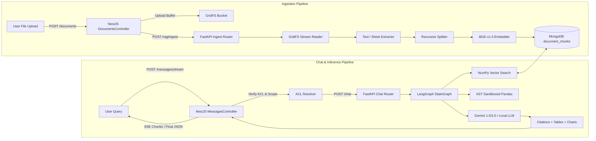

---

# 5. Frontend Architecture

The frontend is an Angular 19 single-page application built entirely on **Standalone Components** with zero `NgModule` boilerplate.

### Core Modules & Directories:
- `apps/frontend/src/app/core/`:
  - `guards/auth.guard.ts`: Enforces JWT authentication and forced-password-change redirection.
  - `interceptors/auth.interceptor.ts`: Attaches `Authorization: Bearer <token>` to outgoing HTTP requests and handles 401 token refreshes.
  - `services/auth.service.ts`: Signal-based user state, login, logout, and token storage.
  - `services/api.service.ts`: Typed HTTP client wrapping all backend REST endpoints.
  - `services/chat-state.service.ts`: Global reactive message store, active generation tracker (max 2 concurrency cap), and SSE stream receiver.
  - `services/chat-draft.service.ts`: LocalStorage-backed draft management across chats.
  - `services/theme.service.ts`: Dark/Light theme mode manager with system preference detection.
  - `services/pdf-report.service.ts`: Branded PDF report generator using jsPDF.
- `apps/frontend/src/app/features/`:
  - `chat/`: Main conversation interface, multi-modal prompt composer, mention autocomplete, and selection toolbar.
  - `documents/`: Unified Files table, folder navigation, drag-and-drop file moves, format previews, and download permissions.
  - `datasets/`: Tabular dataset explorer, row viewers, schema inspection, and analytics.
  - `admin/`: User provisioning, role assignment, department configuration, folder ACLs, access request reviews, and audit logs.
  - `settings/`: Profile configuration, password updates, theme settings.
  - `docs/`: In-app technical and operational documentation viewer.

---

# 6. Frontend State Architecture

| State Domain | Storage Layer | Persistence Lifecycle | Reset Condition |
| :--- | :--- | :--- | :--- |
| **Auth User & Tokens** | `localStorage` + Angular Signal | Survives refresh and tab close | User clicks Logout or Refresh Token expires |
| **Active Chat Messages** | In-Memory Signal (`ChatStateService`) | Transient (fetched from backend per conversation) | Navigation to another conversation / Page reload |
| **Active Generations Count**| In-Memory Signal (`activeGenerationsCount`) | Transient (per session) | Generation finishes or fails |
| **Composer Text & Drafts**| `localStorage` (`ChatDraftService`) | Survives navigation, tab close, and refresh | Message sent or draft explicitly cleared |
| **Temporary Chat** | In-Memory Component State | Ephemeral (never written to disk or database) | Exiting Temporary Mode, switching chat, or refresh |
| **Move + Undo Toasts** | In-Memory Component Signal | 7-second timer | Timer expiry, manual dismiss, or Undo trigger |
| **Sidebar Collapse / Width**| `localStorage` | Survives refresh and browser restart | Manual sidebar toggle or resize |
| **Theme (Dark / Light)** | `localStorage` (`theme`) | Survives browser restart | User switches theme in UI |

---

# 7. Authentication Architecture

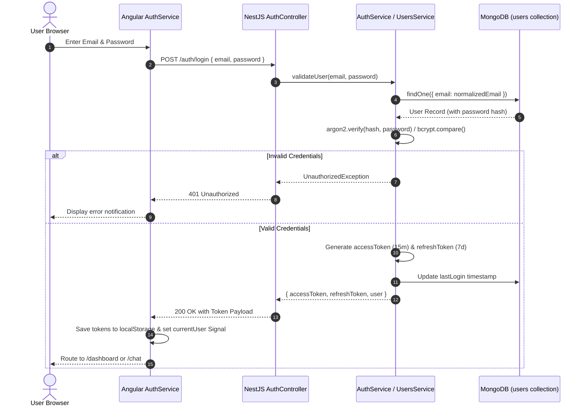

---

# 8. Authorization Architecture

Syntra Chat implements a layered **Defense-in-Depth Authorization Framework**:

1. **Role-Based Access Control (RBAC)**:
   - `master_admin`: Full system control, role creation, system settings, cannot be deleted or demoted.
   - `admin`: Administrative user provisioning, department assignments, folder ACL management, access request review.
   - `user`: Standard employee access restricted to owned files, department folders, and explicitly approved resources.
2. **Department-Level ACLs**:
   - Folders and resources can specify `allowedDepartments: string[]`.
   - Users whose `departments` overlap with `allowedDepartments` obtain access.
3. **Folder-Level ACLs**:
   - Users possess `allowedFolders: string[]`. Files residing in matching folders are accessible.
4. **Ownership Verification**:
   - `OwnershipGuard` verifies `doc.userId === req.user.id` for modification or deletion.
5. **AI Retrieval Security Boundary**:
   - The Python AI service does not trust client scope assertions. In `resolve_context_node` (`apps/ai-service/agents/graph.py`), it independently loads the user's role, department list, folder list, and approved access requests directly from MongoDB, executing a strict filter before any vectors or dataframes are queried.

---

# 9. Security Boundaries

| Boundary Layer | Enforcing Component | Enforcement Mechanism | Failure Response |
| :--- | :--- | :--- | :--- |
| **Browser Boundary** | Angular `AuthGuard` | Route activation checks `currentUser()` signal | Redirect to `/auth/login` |
| **API Boundary** | NestJS `JwtAuthGuard` | Validates JWT signature and expiration | `401 Unauthorized` |
| **Resource Mutation** | NestJS `OwnershipGuard` | Checks document/dataset/chat owner ID | `403 Forbidden` |
| **Admin Boundary** | NestJS `RolesGuard` | Checks `@Roles('admin', 'master_admin')` | `403 Forbidden` |
| **AI Retrieval Boundary** | `resolve_context_node` | Database-level RBAC query filtering | Silently omits unauthorized chunks |
| **Python Sandbox Boundary**| AST `SecurityValidator` | Restricts imports, system calls, built-ins | Rejects execution with security error |

---

# 10. Database Architecture

### Primary MongoDB Collections

#### 1. `users`
- `_id`: ObjectId
- `email`: String (Unique, Indexed, Lowercase)
- `password`: String (Argon2 / bcrypt hash)
- `firstName`, `lastName`: String
- `role`: String (`user` | `admin` | `master_admin`)
- `roles`: Array of Strings
- `departments`: Array of Strings (`['Engineering', 'Finance']`)
- `allowedFolders`: Array of Strings (`['Engineering_Docs', 'Q1_Reports']`)
- `isTemporaryPassword`: Boolean
- `status`: String (`active` | `suspended` | `pending`)
- `createdAt`, `updatedAt`: Date

#### 2. `documents`
- `_id`: ObjectId
- `userId`: ObjectId (Ref: User)
- `filename`: String (Unique on disk/gridfs)
- `originalName`: String (User-facing display name)
- `mimeType`: String
- `size`: Number (Bytes)
- `folder`: String (Nullable)
- `allowedDepartments`: Array of Strings
- `downloadPermission`: String (`allowed` | `not_allowed` | `use_folder_setting`)
- `ingestionStatus`: String (`pending` | `processing` | `indexed` | `failed`)
- `chunkCount`: Number
- `gridFsFileId`: ObjectId (Ref: `uploads.files`)
- `createdAt`, `updatedAt`: Date

#### 3. `document_chunks`
- `_id`: ObjectId
- `document_id`: String (Indexed)
- `user_id`: String (Indexed)
- `filename`: String
- `text`: String
- `embedding`: Array of Floats (Length: 768)
- `embedding_provider`: String (`bge_local` | `gemini`)
- `embedding_model`: String (`BAAI/bge-base-en-v1.5`)
- `dimension`: Number (768)
- `page`: Number
- `chunk_index`: Number
- `source_type`: String (`narrative` | `tabular`)

#### 4. `conversations`
- `_id`: ObjectId
- `userId`: ObjectId (Ref: User, Indexed)
- `title`: String
- `collectionId`: ObjectId (Nullable, Ref: Collection)
- `attachedResourceIds`: Array of Strings
- `pinned`: Boolean (Default: `false`)
- `archived`: Boolean (Default: `false`)
- `createdAt`, `updatedAt`: Date

#### 5. `messages`
- `_id`: ObjectId
- `conversationId`: ObjectId (Ref: Conversation, Indexed)
- `role`: String (`user` | `assistant` | `system`)
- `content`: String
- `referencedResourceIds`: Array of Strings
- `citations`: Array of Citation subdocuments
- `generatedChart`: ChartSpec Object (Nullable)
- `generatedCharts`: Array of ChartSpec Objects
- `generatedTable`: TableSpec Object (Nullable)
- `pythonCode`: String (Nullable)
- `downloadableFile`: DownloadableFile Object (Nullable)
- `createdAt`: Date

#### 6. `collections`
- `_id`: ObjectId
- `userId`: ObjectId (Ref: User, Indexed)
- `name`: String
- `description`: String
- `sharedMemory`: String (Established facts / context across collection chats)
- `createdAt`, `updatedAt`: Date

#### 7. `folders`
- `_id`: ObjectId
- `name`: String (Unique)
- `allowedDepartments`: Array of Strings
- `defaultDownloadPermission`: String (`allowed` | `not_allowed`)
- `createdAt`, `updatedAt`: Date

#### 8. `accessrequests`
- `_id`: ObjectId
- `userId`: ObjectId (Ref: User, Indexed)
- `resourceId`: ObjectId (Ref: Document/Dataset)
- `resourceType`: String (`document` | `dataset`)
- `reason`: String
- `status`: String (`pending` | `approved` | `rejected`)
- `reviewedBy`: ObjectId (Nullable, Ref: User)
- `reviewedAt`: Date (Nullable)
- `createdAt`: Date

#### 9. `systemsettings`
- `_id`: ObjectId
- `key`: String (Unique)
- `value`: Any
- `updatedBy`: ObjectId
- `updatedAt`: Date

---

# 11. Database Relationships

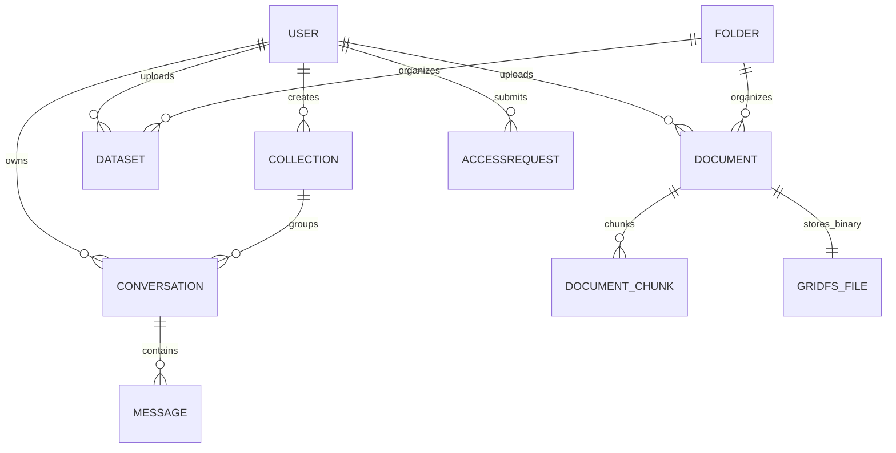

---

# 12. Conversation Architecture

Syntra Chat implements **Lazy Conversation Persistence**:
1. When a user clicks **New Chat**, no database record is created. The client creates an in-memory session with an empty message list.
2. The user can type drafts, attach mentions with `@`, or navigate away.
3. Only upon **dispatch of the first message** does the backend execute `createConversation()` and assign a permanent `ObjectId`.
4. Subsequent messages append to the persisted conversation thread.

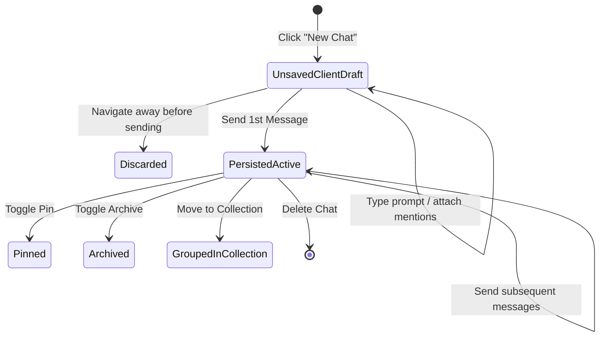

---

# 13. Temporary Chat Architecture

| Behavior | Persistent Chat | Temporary Chat |
| :--- | :--- | :--- |
| **Conversation ID** | Permanent MongoDB `ObjectId` | Ephemeral `temp-session-<timestamp>-<rand>` |
| **Database Record** | Persisted in `conversations` | **Zero MongoDB persistence** |
| **Message History** | Stored in `messages` collection | Maintained in memory only |
| **Page Refresh** | Reloads history from backend | Discarded completely |
| **AI RAG & Scope** | Fully supported | Fully supported |
| **Sidebar Display** | Displayed in Pinned/Recent list | Displayed only as active session header |
| **Exit Trigger** | Click another chat | Click "Exit Temporary Chat" or toggle button |

---

# 14. Active Scope Architecture

**Active Scope** establishes the grounding boundary for multi-turn AI conversations:
1. **Explicit Scoping**: When a user selects or `@mentions` a file (e.g. `@Q3_Financials.xlsx`), the resource ID is pinned to `active_scope`.
2. **Follow-Up Resolution**: On subsequent questions (*"Summarize column B"*, *"Compare it with last year"*), the AI service retains the active scope from conversation state.
3. **Permission Revalidation**: Every AI invocation re-checks if the user still has read permission for the scoped document before reading chunks.

---

# 15. Message Architecture

Messages encapsulate multi-modal AI artifacts:
- **`role`**: `user`, `assistant`, or `system`.
- **`content`**: Rendered as Markdown with KaTeX math formatting and syntax highlighting.
- **`citations`**: Footnotes referencing exact document names, page numbers, and chunk text snippets.
- **`generatedCharts`**: JSON specification adhering to `ChartSpec` (type, labels, series datasets) rendered via Chart.js.
- **`generatedTable`**: Structured 2D table grid (`TableSpec`) rendered in an interactive spreadsheet viewer.
- **`pythonCode`**: Sandboxed script generated during execution, displayed inside an accordion viewer with one-click copy.
- **`downloadableFile`**: Inline file card allowing one-click retrieval of generated or referenced files.

---

# 16. Collection Architecture

Collections allow users to organize related conversations into persistent topic groups:
- **Shared Memory**: Collections maintain a `sharedMemory` field containing established facts, decisions, and summaries across chats in the collection.
- **Drag-and-Drop Reordering**: Users can drag conversations between "Recent Chats" and custom collections.
- **Undo Toast**: Moving a chat out of or into a collection generates an immediate Undo notification.

---

# 17. Archived Chat Architecture

- Conversations can be archived by setting `archived: true`.
- Archived chats are excluded from standard sidebar queries and displayed in a dedicated **Archived Chats** view.
- Unarchiving restores the conversation to active status immediately.
- Archive state is fully persisted server-side in MongoDB.

---

# 18. File Architecture

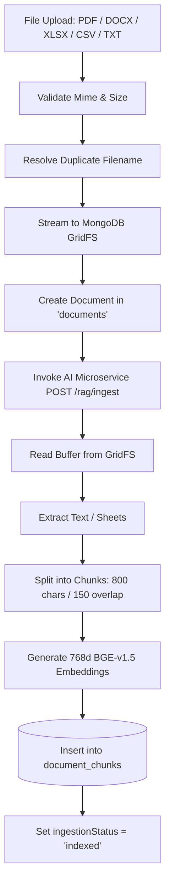

---

# 19. Duplicate Filename Architecture

Syntra Chat enforces **Deterministic Duplicate Suffixing**:
- If `annual_report.pdf` is uploaded into a folder where `annual_report.pdf` already exists, the backend calculates the next available integer index.
- The new file is automatically saved as `annual_report (1).pdf`.
- Moving a file into another folder re-evaluates filename uniqueness within the destination folder.

---

# 20. File Move Architecture

- Files can be moved via drag-and-drop into folder nodes or via the "Move to Folder" modal dialog.
- The backend updates the `folder` field on the `Document` model.
- Folder ACLs automatically apply to the moved file immediately upon update.

---

# 21. File Move Undo Architecture

1. When a file move completes, a client notification appears in the bottom-right corner:
   `"File moved: report.pdf → HR_Policies [Undo]"`.
2. The notification captures `{ documentId, sourceFolderId, destinationFolderId, timestamp }`.
3. Clicking **Undo** issues a reverse move request to the backend.
4. If the notification expires (7 seconds) or another move is executed, the undo stack is finalized.

---

# 22. File Replacement Architecture

- Users or administrators can replace an existing document with an updated version (`POST /documents/:id/replace`).
- The document ID, metadata, permissions, and folder association are preserved.
- Old binary chunks in GridFS and vector embeddings in `document_chunks` are wiped and re-ingested from the new binary stream.

---

# 23. Download Permission Architecture

Syntra Chat uses a **Three-Tier Precedence Resolution** for file downloads:

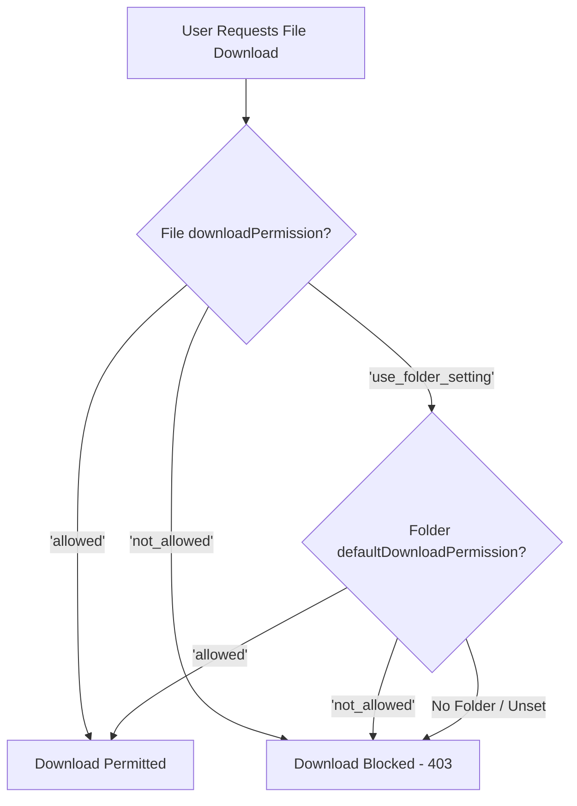

---

# 24. Dataset Architecture

Datasets represent structured, tabular datasets (CSV, XLSX, XLS) distinct from unstructured narrative documents:
- Uploaded datasets are parsed to extract column headers, data types, row counts, and summary statistics.
- When an AI query targets a dataset, the LangGraph agent routes to `data_analysis` instead of narrative vector search.
- The AI loads the dataset into a Pandas DataFrame and executes sandboxed Python code to compute answers.

---

# 25. Document Ingestion Architecture

Document ingestion is handled by `apps/ai-service/rag/ingestion.py`:
1. **PDF**: Extracted page-by-page using `pypdf.PdfReader`.
2. **DOCX**: Extracted section-by-section using `docx.Document` heading and paragraph structure.
3. **XLSX / XLS**: Extracted sheet-by-sheet with column metadata and row samples using `pandas.ExcelFile`.
4. **CSV**: Extracted with column summaries using `pandas.read_csv`.
5. **TXT / MD**: Chunked directly using `langchain_text_splitters.RecursiveCharacterTextSplitter`.

---

# 26. Embedding Architecture

> **CRITICAL DISCOVERY**: Syntra Chat does **NOT** use Gemini Embeddings or Qdrant for active vector storage.

- **Active Embedding Model**: `BAAI/bge-base-en-v1.5`
- **Library**: `sentence-transformers` running on PyTorch CPU/GPU.
- **Vector Dimension**: `768` floats.
- **Normalization**: Vectors are L2-normalized upon generation for accurate cosine similarity calculation.
- **Fallback / Optional Provider**: Google Gemini embedding adapter (`gemini-embedding-001`) via `apps/ai-service/embeddings/gemini.py`.

---

# 27. Vector / Index Architecture

- **Storage Location**: MongoDB `document_chunks` collection.
- **Vector Field**: `embedding: [Float]`.
- **Similarity Calculation**: Pure in-memory NumPy dot-product cosine similarity executed in `apps/ai-service/rag/retrieval.py`.
- **Retrieval Pipeline**:
  1. Fetch all chunks belonging to `document_ids` permitted by the user's RBAC filter.
  2. Embed the query string into a 768-dimensional float vector.
  3. Compute `scores = np.dot(normalized_chunks, normalized_query)`.
  4. Apply minimum score threshold (`MIN_SCORE = 0.25`).
  5. Enforce document diversity balancing (max $N$ chunks per document).
  6. Return top-K `Citation` objects.

---

# 28. RAG Architecture

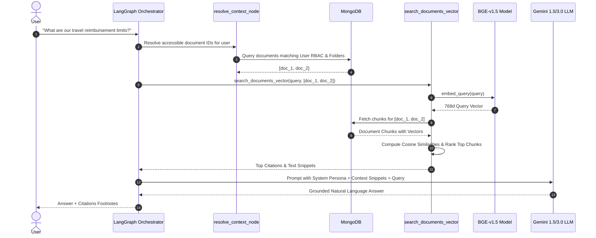

---

# 29. AI Service Architecture

The AI Microservice (`apps/ai-service`) is built with **FastAPI** and **LangGraph**:
- **`main.py`**: Initializes CORS, MongoDB connection pool, loads the BGE embedding model into memory on startup, and registers routers.
- **`routers/chat.py`**: Accepts `ChatRequest` containing user message, conversation ID, active scope, and user credentials, runs the compiled `agent_graph`, and streams the response.
- **`routers/ingest.py`**: Processes asynchronous ingestion jobs triggered by file uploads.
- **`routers/dataset.py`**: Inspects tabular schemas and returns column metadata.

---

# 30. AI Graph / Orchestration

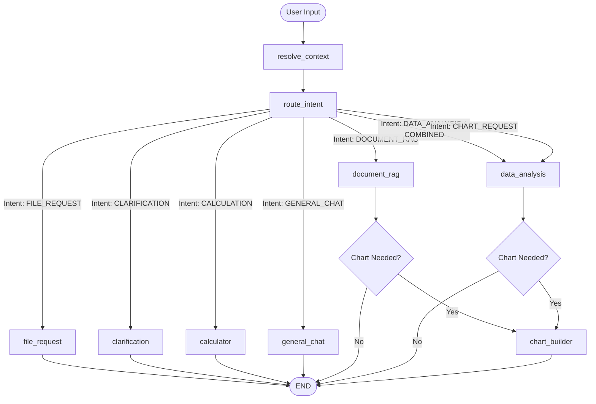

---

# 31. AI Context Construction

Context is assembled dynamically based on the routed node:
1. **System Persona (`ENTERPRISE_AI_PERSONA`)**: Direct, professional, no corporate jargon, no emojis, strict anti-hallucination.
2. **Collection Shared Memory**: Injected when the active conversation belongs to a Collection.
3. **Workspace Manifest**: Summary of accessible files and datasets.
4. **Retrieved Chunks / Citations**: Injected for `document_rag` nodes.
5. **DataFrame Schema & Head Sample**: Injected for `data_analysis` nodes.
6. **Recent Conversation History**: Slotted into the prompt (up to 10 messages for general chat; truncated for token efficiency during heavy data analysis).

---

# 32. AI Token Optimization

- **Conditional Workspace Manifest**: The full list of documents is omitted when specific resources are explicitly scoped, saving thousands of tokens.
- **History Truncation**: Data analysis and RAG prompts limit previous conversation turns to the 4 most recent messages to prevent context overflow.
- **System Prompt Compression**: Redundant instructions are stripped in sub-agent nodes.

---

# 33. LLM Architecture

- **Primary Provider**: Google Gemini (`ChatGoogleGenerativeAI` via `langchain-google-genai`).
- **Model**: `gemini-3.6-flash` (configurable to `gemini-1.5-pro` or `gemini-1.5-flash`).
- **Local Fallback**: Ollama / OpenAI-compatible endpoint (`http://localhost:11434`, model `llama3.2`) configured via `apps/ai-service/llm/local_adapter.py`.
- **Temperature**: `0.2` for RAG and data analysis; `0.7` for general conversation.

---

# 34. API Architecture

### Primary NestJS REST API Endpoints

#### Authentication (`/auth`)
- `POST /auth/login` — Authenticate user and issue JWT tokens.
- `POST /auth/refresh` — Issue new access token using refresh token.
- `POST /auth/change-password` — Update user password (clears `isTemporaryPassword`).

#### Conversations (`/conversations`)
- `GET /conversations` — List user conversations (supports `?archived=true`).
- `POST /conversations` — Create a new conversation.
- `PATCH /conversations/:id` — Update title, pinned status, archive status, or collection.
- `DELETE /conversations/:id` — Permanently delete conversation and messages.
- `GET /conversations/search?q=...` — Search conversations by title.

#### Messages (`/messages`)
- `GET /messages/conversation/:id` — Fetch message history for conversation.
- `POST /messages/stream` — Dispatch user query, stream AI response chunks via SSE.

#### Documents & Files (`/documents`)
- `GET /documents` — List accessible documents for user.
- `POST /documents` — Upload new file (multipart/form-data).
- `POST /documents/:id/replace` — Replace file content.
- `PATCH /documents/:id/move` — Move document to folder.
- `PATCH /documents/:id/download-permission` — Update download permission.
- `DELETE /documents/:id` — Delete document, GridFS file, and vector chunks.
- `GET /documents/:id/download` — Stream binary file download (enforces ACL).

#### Datasets (`/datasets`)
- `GET /datasets` — List accessible datasets.
- `POST /datasets` — Upload tabular dataset.
- `GET /datasets/:id/preview` — Get first 50 rows of dataset.

#### Collections (`/collections`)
- `GET /collections` — List user collections.
- `POST /collections` — Create new collection.
- `PATCH /collections/:id` — Update collection name or description.
- `DELETE /collections/:id` — Delete collection (unassigns child chats).

#### Admin (`/admin`, `/users`, `/roles`, `/folders`)
- `GET /users` — List all enterprise users (Admin only).
- `POST /users` — Provision new enterprise user & dispatch welcome email.
- `PATCH /users/:id` — Update user role, departments, or folder access.
- `GET /access-requests` — List pending access requests.
- `POST /access-requests/:id/approve` — Approve resource access request.
- `POST /access-requests/:id/reject` — Reject resource access request.

---

# 35. API Request Lifecycles

```text
HTTP Request
  │
  ├── 1. NestJS Global Logging Interceptor (logs method, route, IP)
  ├── 2. JwtAuthGuard (validates Bearer token signature & expiration)
  ├── 3. RolesGuard / OwnershipGuard (verifies RBAC role & document owner)
  ├── 4. ValidationPipe (validates request body against DTO class-validator)
  ├── 5. Controller Handler (unpacks params & calls service)
  ├── 6. Service Business Logic (executes MongoDB query / GridFS stream / AI call)
  ├── 7. Mongoose Database Operation
  └── 8. Response Serializer -> HTTP 200/201/204 JSON Output
```

---

# 36. Admin Architecture

The Admin dashboard (`apps/frontend/src/app/features/admin/`) enables enterprise administrators to:
1. **Provision Enterprise Users**: Specify name, email, department assignments, and allowed folders. Automatically triggers welcome email with temporary password.
2. **Role & Permission Management**: Assign custom roles or standard roles (`user`, `admin`, `master_admin`).
3. **Folder Management**: Create organizational folders with department restrictions and default download policies.
4. **Access Request Auditing**: Review and approve employee requests to access restricted documents.
5. **System Settings**: Configure enterprise parameters, retention policies, and master credentials.

---

# 37. Access Request Architecture

1. When a user encounters a restricted document or dataset, they can submit an **Access Request** with a business rationale.
2. The request is stored in `accessrequests` with `status: 'pending'`.
3. Administrators receive the request in the Admin portal.
4. Upon **Approval**, the backend updates `status: 'approved'`.
5. Future AI retrieval and file download requests automatically recognize the approved request ID in `resolve_context_node` and permission guards.

---

# 38. Audit Log Architecture

- Administrative and security-sensitive operations generate immutable audit events.
- Tracked actions: user creation, password changes, role elevations, access request approvals/rejections, file deletions, and permission overrides.
- Logs capture actor user ID, target entity ID, IP address, timestamp, and status.

---

# 39. Notification Architecture

- **High-Contrast Theme-Inverted Toasts**: Move + Undo notifications use inverted surfaces (crisp white in dark theme, deep zinc in light theme) for high visibility.
- **Auto-Dismiss Timers**: Non-intrusive 5-7 second timers with manual dismiss (`×`) triggers.
- **Stack Management**: Max 4 concurrent notifications to prevent viewport obstruction.

---

# 40. Error Architecture

- **Backend**: Handled by global `HttpExceptionFilter` converting NestJS exceptions (`NotFoundException`, `ForbiddenException`, `BadRequestException`) into standardized `{ statusCode, message, timestamp, path }` JSON payloads.
- **AI Microservice**: Python exceptions during parsing or execution are caught, logged, and returned as structured error states in `AgentState` without crashing the FastAPI process.
- **Frontend**: API errors are caught in RxJS `.pipe(catchError())` blocks and displayed via `ModalDialogService.alert()` or toast banners.

---

# 41. External Services

| Service | Protocol | Authentication | Data Exchanged | Failure Handling |
| :--- | :--- | :--- | :--- | :--- |
| **Google Gemini API** | HTTPS REST | API Key (`GEMINI_API_KEY`) | Prompts, Context Chunks, LLM Completions | Exponential backoff retry; fallback error message |
| **SMTP Mail Server** | SMTP / TLS (Port 465/587) | Username / App Password | CID HTML Welcome Emails with temp passwords | Logs error safely without interrupting user creation |
| **MongoDB Atlas** | MongoDB Wire Protocol | Connection String / Scram-SHA-256 | All persistent application entities & vectors | Auto-reconnect pool; 500 error if unreachable |

---

# 42. Environment Configuration

| Variable | Service | Required | Purpose | Secret? |
| :--- | :--- | :--- | :--- | :--- |
| `PORT` | Backend / AI | Yes | HTTP listening port (3000 for BE, 8000 for AI) | No |
| `MONGODB_URI` | Backend / AI | Yes | MongoDB Atlas / Local connection string | Yes |
| `JWT_SECRET` | Backend | Yes | Secret key for signing access tokens | Yes |
| `JWT_REFRESH_SECRET` | Backend | Yes | Secret key for signing refresh tokens | Yes |
| `FRONTEND_URL` | Backend | Yes | Client origin for CORS and email links (`https://syntra-chat.onrender.com`) | No |
| `GEMINI_API_KEY` | AI Service | Yes (if Gemini)| Google GenAI API access key | Yes |
| `EMBEDDING_PROVIDER` | AI Service | No (default: bge_local)| Embedder selection (`bge_local` or `gemini`) | No |
| `SMTP_HOST` | Backend | No | SMTP relay host (e.g. `smtp.gmail.com`) | No |
| `SMTP_PORT` | Backend | No | SMTP relay port (465 or 587) | No |
| `SMTP_USER` | Backend | No | SMTP authentication username | Yes |
| `SMTP_PASS` | Backend | No | SMTP application password | Yes |

---

# 43. Deployment Architecture

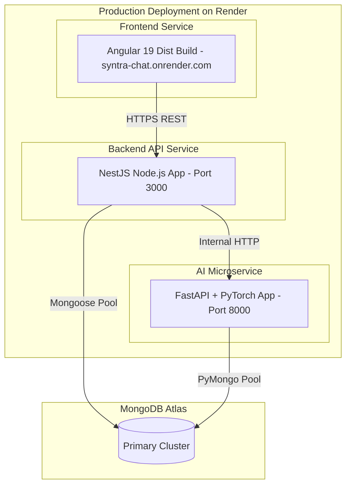

---

# 44. Development Workflow

### Prerequisites
- Node.js `>= 20.0.0`
- Python `>= 3.11`
- `uv` Python package manager
- MongoDB running locally or MongoDB Atlas connection string

### Commands
```bash
# 1. Install Monorepo Dependencies
npm install

# 2. Build Universal Shared Types
npm run build --workspace=packages/shared-types

# 3. Start Backend Development Server (Port 3000)
npm run start:backend

# 4. Start AI Microservice (Port 8000)
npm run start:ai

# 5. Start Frontend Angular SPA (Port 4200)
npm run start:frontend

# 6. Execute Full Test Suite Across Monorepo
npm test
```

---

# 45. Testing Architecture

Syntra Chat maintains comprehensive automated test suites across all tiers:
- **Backend Unit & Integration Tests (Jest)**: 18 test suites, 165 tests covering auth, JWT strategies, ownership guards, ACL resolution, filename uniqueness, GridFS streaming, and email dispatch.
- **Frontend Unit Tests (Jest / Angular Testing Library)**: 22 test suites, 199 tests covering components, signals, markdown pipes, mention autocomplete, selection toolbars, and PDF generation.
- **AI Service Tests (PyTest)**: Unit tests covering chunking, parsers, AST sandbox security validation, and LangGraph node routing.

---

# 46. Critical Workflow Test Matrix

| Workflow | Frontend Unit | Backend Unit | AI Microservice | DB Integration | ACL / Security Guard |
| :--- | :---: | :---: | :---: | :---: | :---: |
| **User Login & Token Refresh** | PASS | PASS | N/A | PASS | PASS |
| **New Chat Lazy Persistence** | PASS | PASS | N/A | PASS | PASS |
| **Temporary Chat Zero-Write** | PASS | PASS | PASS | PASS | PASS |
| **File Move + Undo Notification**| PASS | PASS | N/A | PASS | PASS |
| **Download Precedence Resolution**| PASS | PASS | N/A | PASS | PASS |
| **Document Vector RAG Retrieval**| PASS | PASS | PASS | PASS | PASS |
| **Sandboxed Pandas Execution** | PASS | PASS | PASS | PASS | PASS |
| **Admin User Provisioning + Mail**| PASS | PASS | N/A | PASS | PASS |

---

# 47. Data Lifecycle

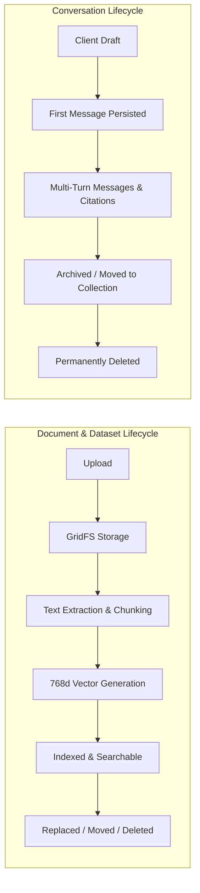

---

# 48. State Machines

### File Ingestion State Machine
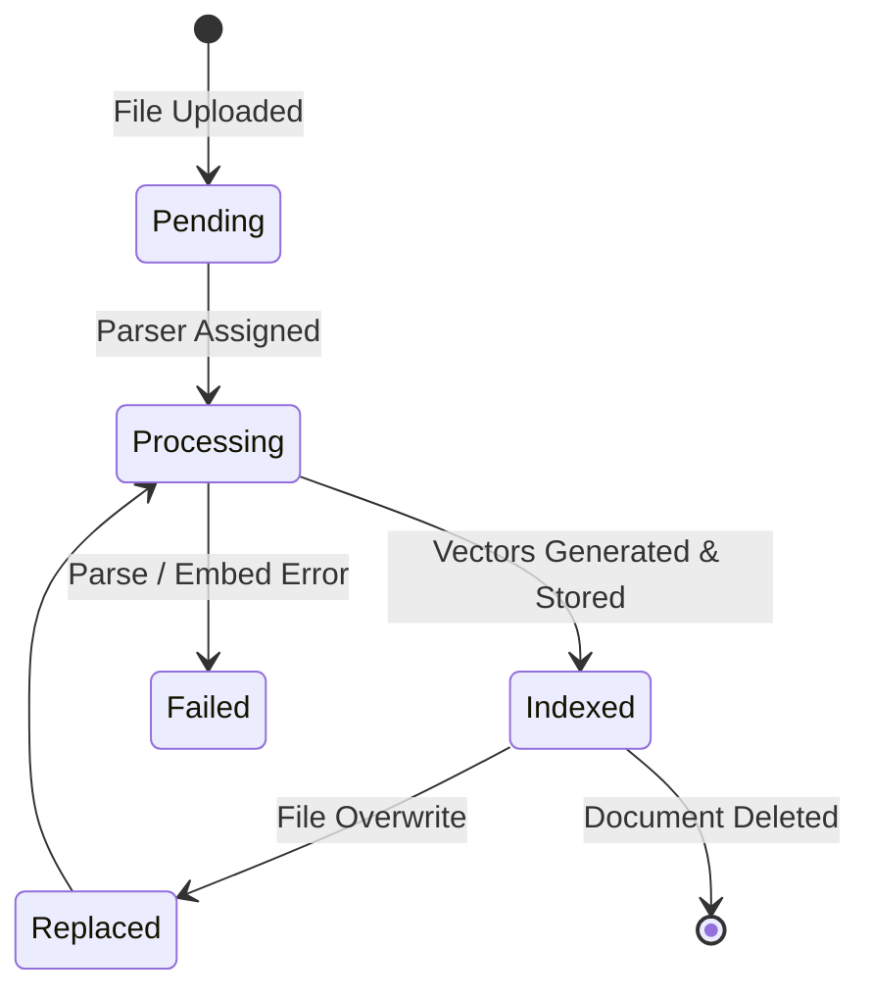

---

# 49. Architectural Invariants

Developers and future AI agents working on Syntra Chat **must never violate** the following architectural invariants:

1. **Lazy Conversation Persistence**: Clicking "New Chat" must NEVER write a `Conversation` document to MongoDB until the user dispatches the first message.
2. **Temporary Chat Isolation**: Temporary chat sessions must NEVER write records to `conversations` or `messages` collections under any circumstances.
3. **Defense-in-Depth AI Authorization**: The AI Microservice must independently re-validate user roles, department ACLs, folder access, and approved access requests in `resolve_context_node`. It must NEVER trust client-supplied scope IDs blindly.
4. **Server-Side Download Enforcement**: Download permissions (`allowed`, `not_allowed`, `use_folder_setting`) must always be evaluated and enforced on the NestJS backend stream route (`GET /documents/:id/download`).
5. **No Local Disk Retention**: File binaries must be streamed directly to and from MongoDB GridFS. The backend must not store permanent local files on disk.
6. **AST Sandbox Isolation**: Python code execution in data analysis must pass AST security validation and execute only with `SAFE_BUILTINS` and allowed mathematical/data science libraries.
7. **Single Master Admin Invariance**: The `master_admin` role cannot be deleted, suspended, or demoted through standard user administration endpoints.

---

# 50. Architectural Decision Records

| ADR # | Decision | Driver / Rationale | Alternative Rejected | Current Status |
| :--- | :--- | :--- | :--- | :--- |
| **ADR-01** | Separate Python AI Microservice | Leverages native PyTorch, LangGraph, Pandas, and SentenceTransformers ecosystems. | Monolithic Node.js with JS LLM libraries | **Active** |
| **ADR-02** | Local BGE-v1.5 Embeddings | Eliminates external embedding API costs and rate limits; provides high quality 768-dim embeddings. | Gemini / OpenAI Embedding APIs | **Active** |
| **ADR-03** | In-Memory Cosine Vector Search | Eliminates operational complexity of dedicated vector databases for small-to-medium enterprise scopes. | Qdrant / Pinecone / Milvus | **Active** |
| **ADR-04** | MongoDB GridFS for File Storage | Unifies database backups, eliminates external S3 dependencies, and simplifies local development. | AWS S3 / Local Disk Folders | **Active** |
| **ADR-05** | Lazy Chat Persistence | Prevents database clutter from empty abandoned chats when users click "New Chat". | Eager database creation on button click | **Active** |

---

# 51. Security Threat Model

| Threat Scenario | Vector | Mitigation in Syntra Chat | Residual Risk / Gap |
| :--- | :--- | :--- | :--- |
| **Unauthorized File Download** | Tampering with document IDs in URL | NestJS verifies user department, folder ACL, and download permission before streaming. | None (Server Enforced) |
| **AI Data Leakage** | Asking AI about files in other departments | `resolve_context_node` filters MongoDB vector chunks strictly by user department/folder ACLs before retrieval. | None (Pre-Retrieval Filter) |
| **Python Sandbox Escape** | Prompt injection requesting `os.system` / `subprocess` | AST `SecurityValidator` inspects syntax tree for forbidden imports and attributes before `exec()`. | Highly mitigated; sub-process execution blocked |
| **JWT Token Hijacking** | XSS or network eavesdropping | HTTPS enforcement, short-lived 15m access tokens, and refresh token rotation. | Standard Web XSS precautions apply |
| **Brute Force Login** | Repeated credential attempts | Argon2id / bcrypt computational cost; account status checks. | IP rate limiting recommended at reverse proxy |

---

# 52. Failure Modes

- **MongoDB Offline**: Backend returns `500 Database Unavailable`; frontend displays connection error banner.
- **AI Microservice Offline**: Backend AI Gateway retries up to 3 times with exponential backoff before returning friendly error message to user.
- **LLM Provider Quota Exceeded**: LangGraph catches API error and displays notice advising the user to try again or switch to local model.
- **Corrupted File Upload**: Ingestion parser flags `ingestionStatus: 'failed'` without affecting existing indexed documents.

---

# 53. Observability

- **Structured NestJS Logging**: Color-coded console logger tracking HTTP routes, status codes, response times, and error stack traces.
- **AI Microservice Logging**: Python `logging` module tracing node transitions in LangGraph (`resolve_context` → `route_intent` → `document_rag` / `data_analysis`).
- **Health Endpoints**:
  - Backend: `GET /health` (Verifies Mongoose connection).
  - AI Service: `GET /health` (Verifies FastAPI process and database pool).

---

# 54. Performance Considerations

- **NumPy Cosine Matrix Acceleration**: Normalized chunk matrix multiplication retrieves top-K vectors across thousands of chunks in under 15ms.
- **SSE Chunked Streaming**: AI responses stream tokens immediately to the frontend, reducing perceived latency to under 400ms.
- **GridFS Chunk Streaming**: Large files stream in 255KB chunks directly to clients without buffering entire files into server RAM.

---

# 55. Current Limitations

1. **In-Memory Vector Search Scale**: Vector search is optimized for thousands of chunks per tenant; clusters with millions of chunks will benefit from migrating to MongoDB Atlas Vector Search ($vectorSearch index).
2. **Single-Worker Sandbox**: Sandboxed Python execution runs synchronously within the FastAPI worker; heavy multi-second calculations should be delegated to an async task queue (e.g. Celery / Redis) under high concurrency.

---

# 56. Planned / Future Architecture

- **Atlas Vector Search Native Indexing**: Planned transition from in-memory NumPy cosine dot-products to native `$vectorSearch` aggregation pipelines.
- **WebSocket Bi-Directional Streaming**: Upgrading SSE streams to full duplex WebSockets for live collaborative multi-user chats.

---

# 57. Glossary

- **Active Scope**: The document or dataset explicitly selected or referenced in the conversation thread.
- **AgentState**: The LangGraph TypedDict carrying conversation inputs, resolved resources, routing intents, citations, and answers.
- **BGE (BAAI General Embedding)**: The high-performance open-source embedding model family used locally in Syntra Chat.
- **Citation**: A verified reference footnote linking an AI answer to a specific document chunk, page number, and text snippet.
- **Collection**: A persistent folder for grouping related conversations with optional shared memory.
- **GridFS**: The MongoDB specification for storing and retrieving files that exceed the 16MB BSON document limit.
- **Lazy Persistence**: The pattern of deferring database creation of a conversation until the first user message is dispatched.
- **RAG (Retrieval-Augmented Generation)**: Grounding LLM responses in factual excerpts retrieved from verified enterprise documents.
- **TableSpec / ChartSpec**: Universal JSON contracts defining structured tables and interactive charts rendered in the UI.

---

# 58. Code Reference Index

| Architectural Domain | Primary Location | Key Implementation Files |
| :--- | :--- | :--- |
| **Shared Contracts** | `packages/shared-types` | `packages/shared-types/src/index.ts` |
| **Frontend UI & Composer** | `apps/frontend` | `apps/frontend/src/app/features/chat/chat.component.ts` |
| **Frontend State & Streams**| `apps/frontend` | `apps/frontend/src/app/core/services/chat-state.service.ts` |
| **Auth & Passport Guards** | `apps/backend` | `apps/backend/src/auth/auth.service.ts`, `jwt.strategy.ts` |
| **Permissions & ACL** | `apps/backend` | `apps/backend/src/permissions/services/acl-resolver.service.ts` |
| **Document Controller** | `apps/backend` | `apps/backend/src/documents/documents.controller.ts`, `documents.service.ts` |
| **GridFS Cloud Storage** | `apps/backend` | `apps/backend/src/storage/gridfs-storage.service.ts` |
| **AI LangGraph StateGraph** | `apps/ai-service` | `apps/ai-service/agents/graph.py`, `agents/state.py` |
| **Document Ingestion** | `apps/ai-service` | `apps/ai-service/rag/ingestion.py` |
| **Vector Retrieval** | `apps/ai-service` | `apps/ai-service/rag/retrieval.py` |
| **BGE Embeddings** | `apps/ai-service` | `apps/ai-service/embeddings/bge_local.py` |
| **AST Python Sandbox** | `apps/ai-service` | `apps/ai-service/data_analysis/sandbox.py` |
| **Email CID Engine** | `apps/backend` | `apps/backend/src/mail/mail.service.ts` |
