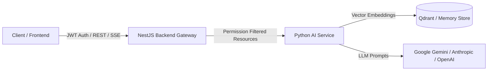

# AI Service Contract Specification

This document details the interface contract between the NestJS backend (`AiGatewayService`) and the Python AI microservice (`FastAPI / LangGraph`).

---

## 1. Overview & Architecture

The NestJS backend acts as the authoritative gatekeeper for authentication, role-based access control (RBAC), and folder/department ACL resolution.



---

## 2. Service Endpoints

### 2.1 `POST /chat`
Executes synchronous conversational reasoning, document RAG, or sandboxed data analysis.

- **Timeout**: `120,000ms` (2 minutes)
- **Max Retries**: `6` attempts with exponential backoff (`(1 + retry) * 2000ms`) on connection issues.

#### Request Schema (`IAiChatRequest`):
```json
{
  "userId": "string",
  "userRole": "admin | user | ...",
  "conversationId": "string",
  "message": "string",
  "resourceIds": ["string"],
  "activeScope": {
    "type": "document | folder | dataset",
    "id": "string",
    "name": "string",
    "updatedAt": "string (ISO)"
  },
  "sharedMemory": "string (optional)",
  "history": [
    {
      "role": "user | assistant | system",
      "content": "string"
    }
  ]
}
```

#### Response Schema (`IAiChatResponse`):
```json
{
  "answer": "string",
  "intent": "general_chat | document_rag | data_analysis | file_request | ungrounded",
  "citations": [
    {
      "documentId": "string",
      "documentName": "string",
      "pageNumber": 1,
      "snippet": "string"
    }
  ],
  "downloadableFile": {
    "documentId": "string",
    "fileName": "string",
    "fileSize": 1024,
    "mimeType": "application/pdf",
    "folder": "string"
  },
  "generatedChart": { ... },
  "generatedTable": { ... },
  "pythonCode": "string (optional)",
  "executionOutput": "string (optional)"
}
```

---

### 2.2 `POST /chat/stream`
Server-Sent Events (SSE) streaming endpoint providing real-time token delivery.

- **Transport**: `text/event-stream`
- **Events**:
  - `event: user_message` &rarr; JSON payload of the accepted user message
  - `event: token` &rarr; JSON payload `{ "token": "partial text" }`
  - `event: metadata` &rarr; JSON payload with citations, charts, tables, execution logs
  - `event: completed_message` &rarr; JSON payload with final assistant message and updated conversation state
  - `event: error` &rarr; JSON payload with error details

---

### 2.3 `POST /rag/ingest`
Extracts narrative document text, generates chunk embeddings, and indexes them in the vector store.

- **Timeout**: `90,000ms`
- **Max Retries**: `3` attempts with exponential backoff (`(1 + retry) * 2000ms`).

#### Request Schema (`IDocumentIngestRequest`):
```json
{
  "documentId": "string",
  "storagePath": "string",
  "filename": "string",
  "fileType": "pdf | docx | txt"
}
```

#### Response Schema (`IDocumentIngestResponse`):
```json
{
  "documentId": "string",
  "chunkCount": 42,
  "status": "ready | failed",
  "errorMessage": "string (optional)"
}
```

---

### 2.4 `POST /datasets/inspect`
Inspects tabular spreadsheets (Excel / CSV), extracting schema, sheet names, row counts, and summary statistics.

- **Timeout**: `90,000ms`
- **Max Retries**: `3` attempts.

#### Request Schema (`IDatasetInspectRequest`):
```json
{
  "datasetId": "string",
  "storagePath": "string",
  "filename": "string",
  "fileType": "csv | xlsx | xls"
}
```

#### Response Schema (`IDatasetInspectResponse`):
```json
{
  "datasetId": "string",
  "totalRows": 1500,
  "sheetNames": ["Sheet1", "Summary"],
  "sheets": [ ... ],
  "status": "ready | failed",
  "errorMessage": "string (optional)"
}
```

---

## 3. Concurrency & Security Policies

1. **User Concurrency Cap**: Maximum 2 concurrent generating sessions per user ID.
2. **Server-Side Authoritative ACL**: The AI service strictly restricts retrieval to `resourceIds` supplied by the backend. The backend validates folder/department ACLs before invoking the AI service.
3. **Structured Server-Side Error Logging**: All non-2xx responses or connection timeouts are logged with timestamp, endpoint, payload summary, status code, and stack trace in NestJS while returning user-friendly messages to the frontend.
